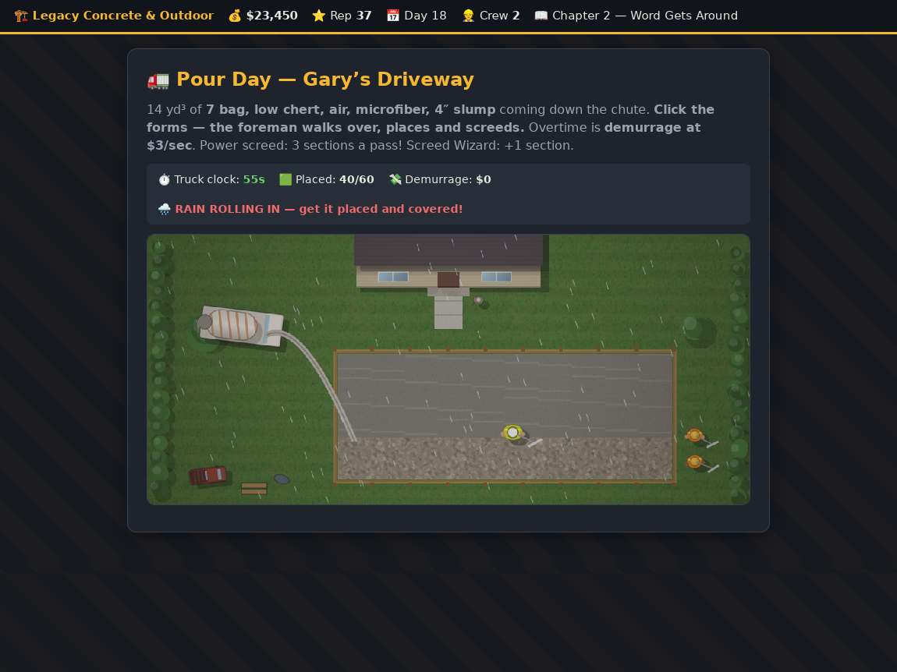
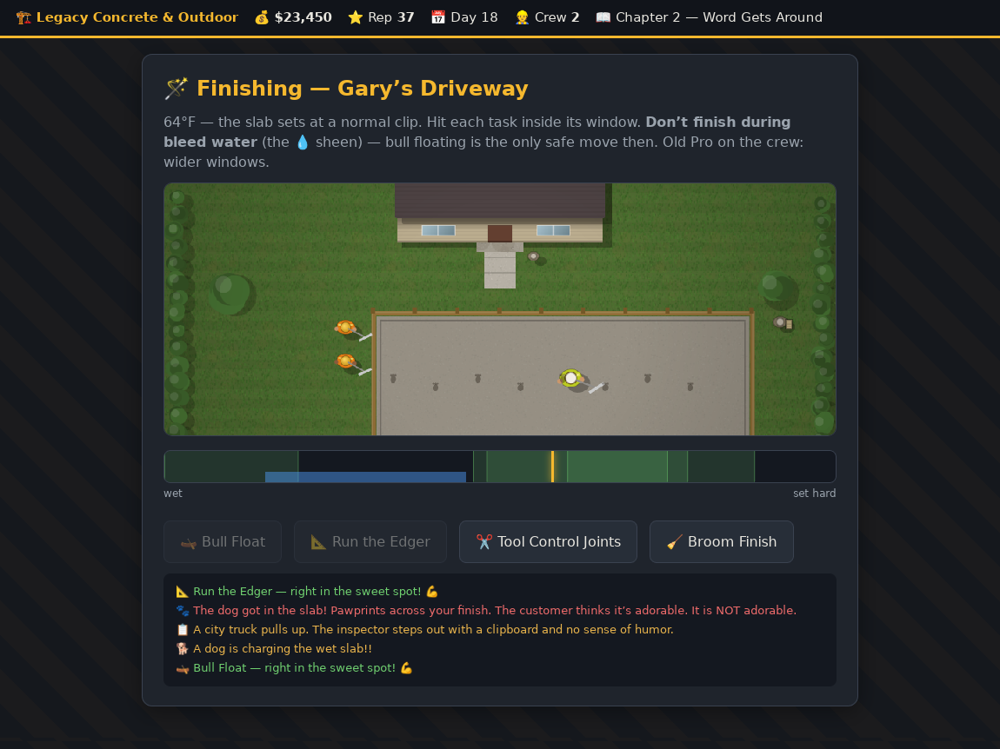

# 🚛 Pour Decisions — A Concrete Business Story

A story-driven concrete contracting sim. Start with your grandpa's finishing
tools and $5,000, and build a flatwork empire one perfect broom finish at a
time — while Big Mike's Discount Concrete races to the bottom across town.

Every phase of a real flatwork job is in the game:

| Phase | What you do |
|---|---|
| ☎️ **Bids** | Walk jobs, measure them, price them against the market (and Big Mike) |
| 🛠️ **Equipment** | Buy iron — plate compactor, laser, power screed, early-entry saw, power trowel, skid steer + breaker — each changes how phases play |
| 🔨 **Demo** | Bust out old driveways, sidewalks, and garage floors |
| 📐 **Forms & flow lines** | Set stake elevations to 1/8″ for proper fall — no bird baths |
| 📠 **Order the mud** | Spec the mix like a pro: *"7 bag, low chert, air, microfiber, 1% NCA, 4″ slump"* — match bags, air %, fiber, accelerator, and slump to the weather and the job |
| 🚛 **Pour** | Place and screed against the truck clock; demurrage isn't a charity |
| ✂️ **Control joints** | Tool or saw-cut joints — 2.5× thickness rule, panels near square |
| 🪄 **Finish** | Bull float, respect the bleed water, edge, broom or power-trowel in the timing windows |

And it plays out in a **gritty top-down world** — GTA-style bird's-eye camera,
everything procedurally drawn (noise-textured asphalt, grass, and concrete;
sun-cast shadows; 2.5D building facades; color grading and vignette). No image
assets anywhere.

- 🗺️ **Town map** — Cedar Falls from above: cracked asphalt with wear tracks
  and a crosswalk, curbs and jointed sidewalks, shingled roofs with extruded
  house fronts, parked cars, your shop with the CONCRETE roof sign, City Hall
  with columns and a dome. Leads appear as `$` markers on real houses; the
  story job is the `★`. Win a bid and your truck drives across town.
- 🚶 **You're the foreman** — on the job site, click where you want to work
  and your guy (white hard hat, lime vest) walks over and does it: swings the
  breaker chunk by chunk during demo, places and screeds mud on pour day,
  steps onto the slab for every finishing pass.
- 🏘️ **Animated job sites** — the old slab cracks and turns to rubble, the
  mixer's drum spins while the chute follows the pour front, bleed water
  sheens across the setting surface, broom lines / trowel swirls / saw cuts
  appear as you work. The customer watches from the porch.
- 👷 **Crew with morale & levels** — hire up to 3 workers, each with a trait
  that changes gameplay (Fast Hands, Screed Wizard, Old Pro, Steady Eye).
  They gain XP and level up (and negotiate raises), and their morale rises
  and falls with job quality — let it crater and they stop performing.
- 🌦️ **Site events** — summer squalls roll in mid-pour and wash your surface
  paste if the slab's still open; the county inspector shows up on story jobs
  with a clipboard and no sense of humor (pass his spec check for rep, fail
  it and word travels); and sometimes a dog charges the wet slab — SHOO it or
  live with the pawprints forever.
- 📆 **Overhead** — every day costs money (truck payment, insurance, coffee).
  Idle time hurts.

Five story chapters (sidewalk → driveways → cold-weather pour → garage floor →
the City Hall plaza showdown), reputation, a Crete-o-pedia of real concrete
knowledge, and cause-and-effect failures: skip air entrainment outside and the
slab scales after winter; hard-trowel a 6%-air mix and it delaminates. Dale
told you. He TOLD you.

## 📸 Screenshots

| | |
|---|---|
|  |  |
|  |  |
|  |  |

More in [`docs/screens/`](docs/screens/) — regenerate with
`node test/screenshots.mjs` (needs `webkit2gtk-driver` + `xvfb`, see the
script header).

## ▶️ Play (web)

It's a zero-dependency static site:

```sh
npx http-server -p 8080 .
# or: python3 -m http.server 8080
```

Open http://localhost:8080. Progress autosaves to localStorage.

It is also a full **PWA** — host it anywhere (GitHub Pages works) and it's
installable from Safari/Chrome with offline play.

## 📱 iOS

Two options:

**1. Install as a web app (no Mac needed)** — host the site over HTTPS, open
it in Safari on iPhone/iPad, then *Share → Add to Home Screen*. Full-screen,
offline-capable, app icon included.

**2. Native app via Capacitor (App Store-ready)** — a generated Xcode project
lives in `ios/`. On a Mac with Xcode + CocoaPods:

```sh
npm install
npm run ios:sync   # stage web assets into www/ and sync the native project
npm run ios:open   # open in Xcode → set your signing team → Run
```

App ID: `com.pourdecisions.game`. Icons and splash screens are already wired
into the asset catalog. Regenerate icons anytime with
`python3 scripts/gen_icons.py`.

## 🧪 Tests

```sh
npm install
node test/smoke.mjs
```

Plays Chapter 1 end-to-end in jsdom — title screen through bid, demo, forms,
mix order, pour, joints, finishing, and the results screen.

## 🗂️ Layout

```
index.html            game shell (PWA meta, script loading)
css/style.css         all styling
js/data.js            equipment, mix pricing, story chapters, Crete-o-pedia
js/minigames.js       demo / forms / pour / joints / finishing minigames
js/game.js            state, hub, bidding, ordering, scoring, story flow
icons/                generated PNG icons (scripts/gen_icons.py)
ios/                  Capacitor Xcode project
scripts/build-www.mjs stages web assets into www/ for Capacitor
test/smoke.mjs        end-to-end smoke test (jsdom)
```
